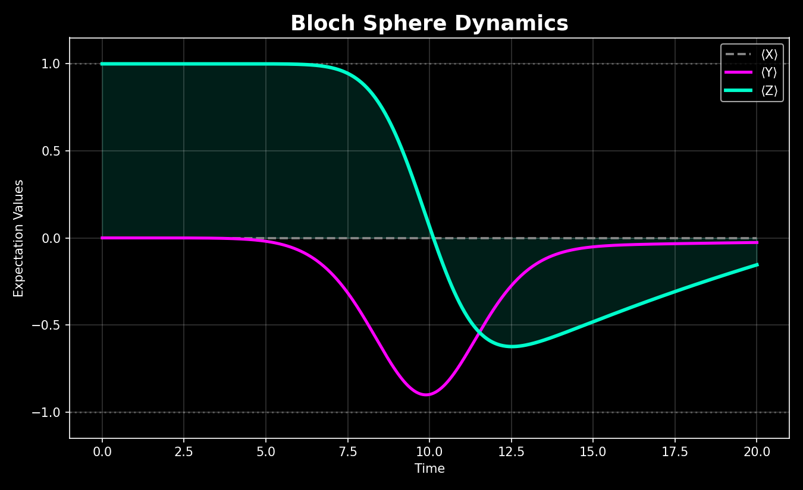

# PulseForge-QC

### Pulse-Level Quantum Control and Optimization of a Noisy Superconducting Qubit

PulseForge-QC is a compact simulation framework for modeling, optimizing, and visualizing microwave-driven qubit dynamics under decoherence. It treats control at the **pulse level** rather than the gate level: a qubit is prepared, driven by a shaped microwave envelope, evolved under realistic noise, and the drive is then optimized to maximize the probability of landing in the target state.

The codebase is intentionally small, but its architecture mirrors the core ideas that appear in real pulse-level control software: Hamiltonian modeling, decoherence-aware simulation, waveform engineering, numerical optimization, and physical interpretation of the resulting dynamics.

---

## Table of Contents

- [Motivation](#motivation)
- [Physics Background](#physics-background)
  - [Driven Qubit Dynamics](#driven-qubit-dynamics)
  - [Gaussian Pulse Engineering](#gaussian-pulse-engineering)
  - [Open Quantum Systems](#open-quantum-systems)
  - [Relaxation and Dephasing](#relaxation-and-dephasing)
  - [Fidelity](#fidelity)
  - [Bloch-Sphere Observables](#bloch-sphere-observables)
- [Features](#features)
- [Software Stack](#software-stack)
- [Project Structure](#project-structure)
- [Module Breakdown](#module-breakdown)
- [Installation](#installation)
- [Running the Project](#running-the-project)
- [Results and Physical Interpretation](#results-and-physical-interpretation)
- [Critical Assessment](#critical-assessment)
- [Future Extensions](#future-extensions)
- [Requirements](#requirements)
- [Author](#author)

---

## Motivation

Real superconducting qubits are not controlled by abstract gates. A gate like "apply X" is a convenient fiction at the circuit level — physically, it is implemented by sending a carefully engineered microwave pulse into the qubit, where the pulse's **amplitude**, **phase**, **duration**, and **shape** jointly determine the resulting evolution.

That turns "apply a gate" into a genuine control-engineering problem:

- the pulse must rotate the qubit by the correct angle to reach the target state,
- decoherence acts continuously throughout the drive, not just at the end, degrading the state while the pulse is still being applied,
- and the control parameters have to be calibrated against that moving target rather than against an idealized closed system.

PulseForge-QC simulates exactly that workflow computationally. The guiding scenario is simple to state and physically meaningful:

> Start from a qubit in the ground state, apply a shaped microwave pulse, evolve the system under realistic T1/T2 noise, and optimize the control pulse to maximize population transfer into the target state.

Everything in the repository — the pulse shape, the noise model, the solver, the optimizer, the diagnostics, and the Qiskit reference — exists in service of answering that one question quantitatively, and then explaining *why* the answer comes out the way it does.

---

## Physics Background

### Driven Qubit Dynamics

A driven two-level system evolves under the Schrödinger equation:

$$i\frac{d}{dt}|\psi(t)\rangle = H(t)|\psi(t)\rangle$$

In the frame rotating at the drive frequency, the Hamiltonian used in this project is:

$$H(t) = \frac{\Delta}{2}\sigma_z + \frac{\Omega(t)}{2}\sigma_x$$

where $\Delta = \omega_q - \omega_d$ is the detuning between the qubit frequency and the drive frequency, $\sigma_x, \sigma_z$ are Pauli operators, and $\Omega(t)$ is the microwave pulse envelope.

The current configuration sets $\omega_q = \omega_d$, so $\Delta = 0$. This removes off-resonant drift from the dynamics entirely and isolates the effect of the control pulse and the decoherence channels — nothing else is competing with the drive for the qubit's evolution. That choice keeps the resulting dynamics easy to interpret physically, which matters later when explaining the Bloch-sphere trajectories.

### Gaussian Pulse Engineering

The control field is shaped as a Gaussian envelope:

$$\Omega(t) = A\exp\left(-\frac{(t-t_0)^2}{2\sigma^2}\right)$$

where $A$ is the pulse amplitude, $t_0$ is the pulse center, and $\sigma$ controls the pulse width.

The Gaussian shape isn't an arbitrary convenience. Smooth pulses are the standard choice in superconducting-qubit control because abrupt waveform discontinuities introduce high-frequency spectral content that can excite unwanted transitions and distort the intended dynamics. So even this single-parameter pulse already reflects a real hardware-aware control principle: smoother pulses generally produce cleaner dynamics.

### Open Quantum Systems

Real qubits are not isolated. They interact with electromagnetic environments, substrate defects, control electronics, thermal noise, and surrounding circuitry. As a result, energy decays, phase coherence is lost, and gate operations become imperfect even when the control pulse itself is ideal.

The project models these effects with the Lindblad master equation:

$$\dot{\rho} = -i[H,\rho] + \sum_k\left(L_k\rho L_k^\dagger - \frac{1}{2}\{L_k^\dagger L_k, \rho\}\right)$$

where $\rho$ is the density matrix and $L_k$ are collapse operators encoding irreversible interaction with the environment. This formalism matters because pure-state (Schrödinger-equation) evolution alone cannot represent relaxation or dephasing — the density-matrix framework is what lets coherent dynamics, population transfer, relaxation, and decoherence all be captured simultaneously in one consistent picture.

### Relaxation and Dephasing

Two standard decoherence channels are included.

**T1 relaxation** transfers population $|1\rangle \to |0\rangle$. This directly competes with the goal of preparing the excited state: even if the pulse initially drives the qubit upward, relaxation continuously pulls population back toward the ground state throughout the evolution, not just after the pulse ends.

**T2 dephasing** destroys phase coherence, $\rho_{01} \to 0$, without necessarily changing the populations immediately. This weakens coherent rotations and suppresses the interference effects that accurate state preparation depends on.

### Fidelity

The target state is $|1\rangle$. The simulator evaluates the final-state fidelity:

$$F = \langle 1|\rho_f|1\rangle$$

which measures how successfully the pulse prepared the excited state by the end of the evolution. The optimization routine searches for the pulse amplitude that maximizes this quantity.

### Bloch-Sphere Observables

The expectation values $\langle X\rangle, \langle Y\rangle, \langle Z\rangle$ are the Cartesian coordinates of the qubit state on the Bloch sphere. Physically, $\langle Z\rangle$ tracks population inversion, while $\langle X\rangle$ and $\langle Y\rangle$ track quantum coherence: transverse decay in these components indicates decoherence, while coherent oscillation indicates active pulse-driven control. Monitoring all three observables over time gives far more physical insight than looking at the final fidelity alone — it shows *how* the state got there, not just where it ended up.

---

## Features

- Gaussian pulse engineering
- Time-dependent Hamiltonian simulation
- Lindblad master equation evolution (QuTiP `mesolve`)
- T1 relaxation modeling
- T2 dephasing modeling
- Pulse amplitude optimization (SciPy L-BFGS-B)
- Bloch-sphere trajectory visualization
- Qiskit-based ideal gate verification
- Modular scientific software architecture

---

## Software Stack

| Library | Purpose |
|---|---|
| QuTiP | Open quantum system simulation |
| Qiskit | Quantum circuit verification |
| NumPy | Numerical computation |
| SciPy | Numerical optimization |
| Matplotlib | Visualization |

---

## Project Structure

```text
PulseForge-QC/
│
├── README.md
├── requirements.txt
├── main.py
│
├── config/
│   └── system_config.py
│
├── pulses/
│   └── pulse_shapes.py
│
├── noise/
│   └── noise_model.py
│
├── simulation/
│   └── pulse_simulator.py
│
├── optimization/
│   └── optimize_pulse.py
│
├── visualization/
│   └── bloch_visualization.py
│
├── qiskit_layer/
│   └── qiskit_verification.py
│
└── results/
    └── bloch_dynamics.png
```

---

## Module Breakdown

### `config/system_config.py`

Holds all physical and numerical parameters: qubit frequency, drive frequency, decoherence times ($T_1$, $T_2$), pulse duration, Gaussian width, and simulation resolution. The resonant-drive condition ($\omega_q = \omega_d$) is set here, which is important because it removes unnecessary detuning effects and isolates the control dynamics from the rest of the system.

### `pulses/pulse_shapes.py`

Defines the Gaussian pulse envelope as a standalone function of time. Waveform generation is kept in its own module because pulse shaping is a core abstraction in pulse-level control systems — it is the one piece of the pipeline a hardware engineer would actually redesign first when moving to DRAG or other shaped pulses.

### `noise/noise_model.py`

Constructs the Lindblad collapse operators for relaxation and dephasing from $T_1$ and $T_2$. These operators encode irreversible qubit-environment interaction; without them the simulation would describe an idealized closed system rather than realistic noisy hardware.

### `simulation/pulse_simulator.py`

The core simulation engine. Responsible for building the time-dependent Hamiltonian, calling QuTiP's `mesolve` to evolve the Lindblad dynamics, and evaluating the final-state fidelity. This module is where pulse design is connected directly to a physical outcome — every other module either feeds parameters into it or consumes its output.

### `optimization/optimize_pulse.py`

Uses SciPy's L-BFGS-B to tune the pulse amplitude. This is not simply searching for a bigger number — it is searching for the control strength that best balances coherent rotation against decoherence losses over the fixed pulse duration. The optimization landscape is nontrivial precisely because coherent control and decoherence compete throughout the evolution rather than at a single instant.

### `visualization/bloch_visualization.py`

Plots $\langle X\rangle, \langle Y\rangle, \langle Z\rangle$ across the full pulse evolution and saves the figure to `results/bloch_dynamics.png`. This is critical because the Bloch trajectory reveals *how* the state evolves over time, not just whether the final fidelity is high or low.

### `qiskit_layer/qiskit_verification.py`

Constructs an ideal single-qubit X-gate in Qiskit and reports its exact final statevector. This provides a clean, decoherence-free reference against which the noisy pulse-driven evolution can be compared. The distinction between ideal gate evolution and realistic pulse dynamics is one of the central ideas in quantum control, and this module makes that distinction explicit and quantitative.

---

## Installation

### Clone the Repository

```bash
git clone https://github.com/SoumyajitPal-2210/PulseForge-QC.git
cd PulseForge-QC
```

### Create a Virtual Environment (Recommended)

**Linux / macOS**

```bash
python -m venv venv
source venv/bin/activate
```

**Windows**

```bash
python -m venv venv
venv\Scripts\activate
```

### Install Dependencies

```bash
pip install -r requirements.txt
```

This installs NumPy, SciPy, Matplotlib, QuTiP, and Qiskit at the versions pinned in `requirements.txt`.

---

## Running the Project

```bash
python main.py
```

The execution pipeline performs, in order:

1. baseline pulse simulation,
2. pulse amplitude optimization,
3. optimized pulse re-simulation,
4. Bloch-sphere visualization (saved to `results/bloch_dynamics.png`),
5. Qiskit ideal-gate reference verification.

Expected console output:

```text
==============================
 QUANTUM CONTROL SIMULATION
==============================

Baseline fidelity: 0.312912

Optimization Results
----------------------
Optimal amplitude: 0.662160
Optimal fidelity: 0.577298

Reference X-Gate Circuit
     ┌───┐
q_0: ┤ X ├
     └───┘

Ideal Final Statevector:
Statevector([0.+0.j, 1.+0.j],
            dims=(2,))
```

> **QuTiP version note:** `simulation/pulse_simulator.py` calls `mesolve` with `c_ops` passed as a keyword argument, matching the QuTiP ≥5.0 signature pinned in `requirements.txt`. If you're running an older QuTiP 4.x environment, pass `c_ops` positionally instead (`mesolve(H, rho0, tlist, c_ops, args=...)`).

---

## Results and Physical Interpretation

The project was executed end-to-end with the current system parameters: $T_1 = 20$, $T_2 = 30$, Gaussian width $\sigma = 2$, pulse duration $= 20$, resonant drive ($\Delta = 0$).

```text
Baseline fidelity: 0.312912

Optimization Results
----------------------
Optimal amplitude: 0.662160
Optimal fidelity: 0.577298
```

### Baseline Fidelity Analysis

The initial fidelity, $F \approx 0.31$ at amplitude $A=1.0$, is relatively poor. The original Gaussian pulse does not produce an accurate qubit inversion under the current noisy dynamics. That outcome is physically meaningful rather than a sign of a broken simulator: the pulse must simultaneously rotate the qubit correctly, avoid overshooting, and compete against decoherence acting throughout the drive. A naive, uncalibrated pulse amplitude rarely succeeds immediately in a realistic control problem — the low baseline fidelity is evidence that calibration matters, which is exactly the premise this project is built to demonstrate.

### Optimization Behavior

After optimization, $F \approx 0.58$ at $A \approx 0.662$ — almost double the baseline. This confirms three things at once: the simulator responds correctly to the control parameter, the control landscape contains real recoverable structure (the optimizer isn't just sitting at its initial guess), and the L-BFGS-B optimization loop is functioning correctly.

The fidelity still remains far below fault-tolerant thresholds, but that limitation is expected given how constrained the control model is. Only the pulse **amplitude** is optimized — pulse width, phase, center, pulse family, and drive structure are all held fixed. The optimizer is therefore solving a tightly constrained one-parameter control problem, not a fully expressive one, and the result should be read in that light.

### Bloch-Sphere Analysis

<p align="center">
  
</p>

<p align="center"><sub>⟨X⟩, ⟨Y⟩, ⟨Z⟩ expectation values across the pulse duration, evaluated at the optimized amplitude (A ≈ 0.662).</sub></p>

This trajectory is the most physically informative output of the simulation — it shows *how* the qubit got to its final fidelity, not just the number itself.

**Why ⟨X⟩ stays at ≈ 0 throughout.** The control Hamiltonian is proportional to $\sigma_x$. A Hamiltonian generated by $\sigma_x$ produces rotations *around* the x-axis of the Bloch sphere, which means the x-component of the Bloch vector is approximately conserved while the state rotates in the y–z plane. That is exactly what the flat blue line shows. This is not an uninteresting flat line — it's a sanity check that the Hamiltonian implementation, the pulse coupling direction, and the resulting Bloch geometry are all internally consistent with the stated physics.

**Why ⟨Y⟩ develops a strong oscillation.** The qubit starts at $\langle Z\rangle \approx +1$, the ground state $|0\rangle$. As the Gaussian pulse turns on (centered at $t=10$), coherent superpositions begin to form, and that coherence appears as the large transient excursion in $\langle Y\rangle$ — it swings down to roughly $-0.9$ near the pulse center, reflecting strong coherent rotation. After the pulse passes its peak, $\langle Y\rangle$ rises back toward zero. That decay is physically important in its own right: it is dephasing and environmental damping acting on the coherence generated by the drive, visualized directly rather than inferred from the final fidelity alone.

**Why ⟨Z⟩ never reaches −1.** A perfect inversion would drive $\langle Z\rangle \to -1$, corresponding to a clean preparation of $|1\rangle$. In the plot, $\langle Z\rangle$ falls steeply starting around $t \approx 5$, crosses zero near the pulse center, and bottoms out around $-0.63$ near $t \approx 12$–13 — a substantial but incomplete inversion. It then partially relaxes back toward less negative values for the remainder of the evolution. This trajectory explains the limited 0.577 fidelity directly: the pulse produces real, partial inversion, but decoherence removes population and coherence decays *during* the drive itself, and the single-parameter pulse model has no mechanism left to compensate once that has happened.

**The central physical insight.** The optimizer is not failing numerically — the control model itself is limited. It successfully finds the best amplitude *within the chosen one-parameter Gaussian pulse family*, but a single amplitude cannot simultaneously fix coherent rotation, counteract continuous decoherence, and correct for accumulated phase error. This is exactly the motivation behind the multi-parameter and closed-loop pulse-shaping methods used in real calibration pipelines — DRAG pulses, GRAPE optimization, CRAB methods, and iterative closed-loop calibration all exist specifically to address what this minimal model exposes cleanly: a one-parameter Gaussian pulse hits a hard, interpretable fidelity ceiling under realistic decoherence.

---

## Critical Assessment

The current implementation is intentionally simple, but physically meaningful.

**What it already demonstrates well:**
- pulse-driven qubit control,
- open-system dynamics,
- decoherence-aware simulation,
- fidelity optimization,
- Bloch-sphere diagnostics,
- ideal-versus-noisy gate comparison.

**What still limits current performance:**
- only one control degree of freedom is optimized (amplitude),
- the pulse family is fixed to a single Gaussian,
- no phase calibration is included,
- no DRAG correction is used,
- the model is single-qubit only,
- the noise model uses generic $T_1$/$T_2$ rather than hardware-calibrated values.

These limitations are useful rather than embarrassing — they expose the real challenges of quantum control instead of artificially producing unrealistically high fidelities that wouldn't reflect anything about actual hardware constraints.

---

## Future Extensions

- DRAG pulse implementation to suppress leakage and phase error
- joint optimization over amplitude, width, and phase
- GRAPE optimal control
- CRAB optimization
- multi-qubit dynamics
- transmon (multi-level) Hamiltonian modeling instead of a strict two-level qubit
- stochastic noise channels
- pulse scheduling
- closed-loop calibration simulation
- Qiskit Dynamics / Qiskit Pulse backend integration
- quantum process tomography

---

## Requirements

```text
numpy>=1.24
scipy>=1.10
matplotlib>=3.7
qutip>=5.0
qiskit>=1.0
```

---

## Author

**Soumyajit Pal**

Project focus: pulse-level quantum control, open quantum systems, noisy quantum dynamics, scientific quantum software, numerical optimization.
